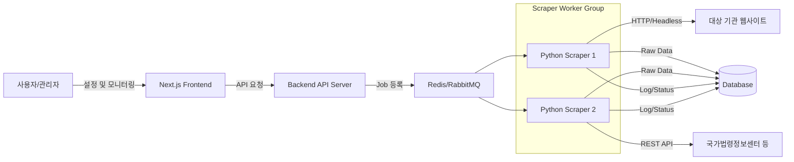

# ScrapingFuncSetting.md - 웹 스크래핑 기능 상세 설정 및 설계

> **문서 개요**: 본 문서는 `WebScraperRAG.md`의 "3.1 웹 스크래퍼" 모듈에 대한 상세 구현 설계를 다룬다. 특히 11개 대상 기관에 대한 구체적인 수집 설정, 스케줄링 전략, 에러 대응, UI/UX 기능 명세를 정의하여 실제 개발의 기준점(Baseline)으로 삼는다.

---

## 1. 기본 운영 방침

1.  **독립 실행 환경**: 백엔드 스크래퍼는 Python(Scrapy/Playwright) 기반의 독립 프로젝트로 구성하며, 메인 플랫폼(Next.js)과는 API 및 DB/Queue를 통해 느슨하게 결합한다.
2.  **데이터 무결성 우선**: 중복 수집 방지, 원본 데이터 해시(Hash) 검증, 메타데이터 정규화를 통해 데이터의 신뢰성을 보장한다.
3.  **하이브리드 수집 전략**: 
    *   **Web Scraping**: 일반적인 게시판 형태의 웹사이트 (Playwright + Scrapy)
    *   **API Integration**: 공공데이터포털, 국가법령정보센터 등 정형 데이터 제공처 (Python `requests`/`aiohttp`)
4.  **반자동(Human-in-the-loop) 유지보수**: 사이트 구조 변경 시 완전 자동 복구보다는 **"AI 진단 + 운영자 승인"** 프로세스를 통해 안정성을 확보한다.

---

## 2. 시스템 아키텍처 및 데이터 흐름



---

## 3. 설정 모델 (데이터 스키마)

### 3.1 Organization (대상 기관)
| 필드명 | 타입 | 설명 | 예시 |
|---|---|---|---|
| `org_id` | String (PK) | 기관 고유 식별자 | `mcee` (환경부) |
| `org_name` | String | 기관명 | 환경부 |
| `base_url` | String | 기본 도메인 주소 | `https://me.go.kr` |
| `collection_mode` | Enum | 수집 방식 | `web_scraping`, `api_only`, `hybrid` |
| `auth_config` | JSON | 로그인/API 키 설정 | `{"type": "api_key", "oc": "kaikan00"}` |
| `status` | Enum | 활성 상태 | `active`, `paused`, `maintenance` |
| `org_type` | Enum | 기관 종류(UI 분류용) | `국가기관`, `유관기관`, `협회 및 학회` |
| `logo_path` | String | 로고 경로(UI 표시용) | `/logos/orgs/mcee.png` |
| `default_policy` | JSON | 기본 요청 정책(보드에 기본 상속) | `{"rps": 0.2, "timeout_sec": 30}` |
| `api_profile` | JSON | **기관 레벨 API 기본 프로필(비시크릿)** | `{ "enabled": true, "base_url": "...", "format": "xml", ... }` |

---

### 3.1.1 API Profile (기관 레벨) — *개편안*
> **목표**: `api_only`/`hybrid` 기관은 “보드별 API 설정” 전에 **기관 레벨의 공통 API 호출 전제**(인증/기본 파라미터/엔드포인트/응답 구조)를 먼저 정의해야 한다.  
> **원칙**: **Human-in-the-loop**. LLM 기반 자동 분석은 “제안”만 하고, **운영자 승인/테스트 후 적용**한다.

#### A) `api_profile`(비시크릿) 스키마(필드 정의)
아래는 **시크릿(API Key/토큰 값 자체)은 제외**한 “공개 설정”만 저장하는 스키마이다.

| 필드명 | 타입 | 설명 | 예시 |
|---|---|---|---|
| `enabled` | Boolean | 기관 API 프로필 사용 여부 | `true` |
| `profile_name` | String | 프로필 이름(운영용) | `LAWGO_OPENAPI_V1` |
| `source` | JSON | 가이드 출처(문서/링크/수동) 기록 | `{ "type": "url", "value": "https://open.law.go.kr/..." }` |
| `base_url` | String | API 베이스 URL | `https://open.law.go.kr` |
| `format` | Enum | 응답 포맷 | `xml` / `json` |
| `auth` | JSON | **시크릿 참조 포함한 인증 정의**(값 자체는 별도 저장) | `{ "type":"api_key", "in":"query", "name":"authKey", "secret_ref":"ENV:SCRAPER_LAWGO_AUTHKEY" }` |
| `constraints` | JSON | 제약 사항(운영 메모/검증) | `{ "ip_allowlist_required": true, "rate_limit_hint":"..." }` |
| `endpoints` | Array | 엔드포인트 목록(목록/본문/검색 등) | `[{"name":"lawSearch","path":"/LSO/...","method":"GET"}]` |
| `default_params` | JSON | 기본 파라미터(시크릿 제외) | `{ "OC":"kaikan00", "type":"XML" }` |
| `param_schema` | Array | 파라미터 스키마(필수/타입/설명) | `[{"name":"OC","required":true,"type":"string"}]` |
| `pagination` | JSON | 페이징 방식 | `{ "type":"page", "page_param":"page" }` |
| `incremental` | JSON | 증분 동기화 기준(since) | `{ "type":"date", "param":"from", "format":"YYYYMMDD" }` |
| `mapping` | JSON | 응답 매핑(필드→경로). **XML도 고려** | `{ "title":"//title", "date":"//announceDt" }` |
| `notes` | String | API 프로필 메모 | `"IP 제한. XML 응답."` |
| `status` | Enum | 프로필 상태 | `draft` / `active` / `deprecated` |

#### B) 시크릿 분리 저장(필수)
**절대 저장 금지**: API Key/토큰/비밀번호 등 시크릿을 `scraper-targets.json`에 평문으로 저장하지 않는다.

- **비시크릿 저장 위치**: `frontend/data/scraper-targets.json`의 `org.api_profile`
- **시크릿 저장 위치(권장)**:
  - 개발: `frontend/.env.local` (Git에 커밋 금지)
  - 운영: 배포 환경(서버/플랫폼)의 Secret Manager 또는 환경변수
- **참조 규칙**: `api_profile.auth.secret_ref`는 아래 형식만 허용
  - `ENV:변수명` (예: `ENV:SCRAPER_LAWGO_AUTHKEY`)

#### C) 보안/운영 주의점(반드시 반영)
- **민감정보 유출 방지**: 업로드 문서/URL에서 키가 포함될 수 있으므로 LLM 전달 전 마스킹/경고 필요
- **승인 프로세스**: LLM이 생성한 설정은 “제안→테스트→승인” 단계로만 적용
- **XML 대응**: 국가법령정보/법제처 계열처럼 XML 응답이 많으므로 `mapping`은 XPath/키경로 모두 고려
  - 참고: 법제처/국가법령정보 OPEN API 가이드 예시(다수 항목) `https://open.law.go.kr/LSO/openApi/guideList.do`

### 3.2 Board (수집 대상 게시판/API 엔드포인트)
| 필드명 | 타입 | 설명 | 예시 |
|---|---|---|---|
| `board_id` | String (PK) | 게시판 고유 식별자 | `mcee_gosi` |
| `org_id` | String (FK) | 소속 기관 | `mcee` |
| `board_name` | String | 게시판/데이터명 | 고시/훈령 |
| `list_url` | String | 목록 페이지/API URL | `.../list.do` |
| `doc_type` | Enum | 문서 유형 | `notice`, `law`, `press`, `tech` |
| `access_mode` | Enum | 접근 방식 | `static_html`, `dynamic_js`, `api`, `download_only` |
| `parse_rules` | JSON | CSS/XPath 선택자 등 파싱 규칙 | `{"title": ".subject", "date": ".date"}` |
| `schedule_cron` | String | 수집 주기(Cron) | `0 9 * * *` (매일 09시) |

---

### 3.3 Board 재정의(개정안): collection_mode 중심 + 수집 파이프라인 설정
> **배경**: 단일 `access_mode`만으로는 `api_only`/`hybrid`를 충분히 표현하기 어렵다.  
> **원칙**: 기관의 `collection_mode`를 “기본 템플릿”으로 삼고, 보드(Board)는 **수집 파이프라인의 최소 단위**로 정의한다.

#### 3.3.1 보드 ID 생성 규칙(혼란 방지)
- **규칙**: `"{org_id}_board{n}"` 형식만 허용  
  - 예: `mcee_board1`, `mcee_board2` …
- **정책**:
  - UI에서 자동 생성/자동완성 제공
  - 규칙 불일치 시 저장 차단(서버/API에서도 동일 규칙 검증)

#### 3.3.2 공통 필드(모든 보드에 공통)
| 필드명 | 타입 | 설명 | 예시 |
|---|---|---|---|
| `board_id` | String(PK) | 보드 ID(규칙 기반) | `mcee_board3` |
| `org_id` | String(FK) | 기관 | `mcee` |
| `board_name` | String | 보드 표시명 | 보도자료 |
| `enabled` | Boolean | 수집 대상 여부 | `true` |
| `doc_type` | Enum | 콘텐츠 분류(게시판 성격) | 보도자료/공지/고시·훈령·예규/입법예고/법령/기술문서/정책/연보·월보/통계자료/산업동향 |
| `domain_tags` | String[] | 분야 태그(복수) | `["대기","수질"]` |
| `schedule_cron` | String | 보드별 수집 주기 | `0 9 * * *` |
| `dedup_key` | Enum | 중복 방지 기준 | `url`, `id`, `hash` |
| `published_date_rule` | JSON | 게시일 추출 규칙 | `{ "source": "list", "selector": "td:nth-child(5)", "format": "YYYY-MM-DD" }` |
| `collection_range` | JSON | 수집 범위(게시일 기준) | `{ "type": "yearly", "years": [2025, 2026] }` |
| `collection_targets` | JSON | 수집 대상 설정 | `{ "title_body": true, "attachments": { "enabled": true, "all": true } }` |
| `web_config` | JSON | Web Scraping 설정(아래 참조) | - |

#### 3.3.2.1 collection_range 상세 스키마
| 필드명 | 타입 | 설명 | 예시 |
|---|---|---|---|
| `type` | Enum | 범위 유형 | `period` / `relative` / `yearly` |
| `period_start` | String | 시작일(type=period) | `2025-01-01` |
| `period_end` | String | 종료일(type=period) | `2025-12-31` |
| `relative_days` | Number | 상대 일수(type=relative) | `30` (수집일 기준 30일 전까지) |
| `years` | Number[] | 연도 목록(type=yearly) | `[2025, 2026]` |

#### 3.3.2.2 collection_targets 상세 스키마
| 필드명 | 타입 | 설명 | 예시 |
|---|---|---|---|
| `title_body` | Boolean | 게시글 제목/본문 수집 | `true` |
| `attachments.enabled` | Boolean | 첨부파일 수집 | `true` |
| `attachments.all` | Boolean | 전체 파일 형식 수집 | `true` |
| `attachments.hwpx` | Boolean | HWPX 파일 수집 | `false` |
| `attachments.docx` | Boolean | DOCX 파일 수집 | `false` |
| `attachments.xlsx` | Boolean | XLSX/CSV 파일 수집 | `false` |
| `attachments.pdf` | Boolean | PDF 파일 수집 | `false` |

#### 3.3.3 모드별 설정(Template)
보드는 `board_mode`에 따라 아래 중 하나의 설정 블록을 가진다.

##### A) Web Scraping(`board_mode = web_scraping`)
- **핵심**: 목록/상세 HTML 파싱 + 첨부 다운로드 + (필요 시) 렌더링
- `web_config` 예시(개념):
  - `list`: `container_selector`, `item_selector`, `pagination`(next/button/page param)
  - `parse_rules`: `title`, `date`, `link` (CSS 선택자)
  - `detail`: `content_selector`, `title_selector`
  - `rendering`: `static_html` or `dynamic_js`(wait/scroll/timeout)
  - `collect_body`: 본문 수집 여부 (boolean)
  - `collection_range`: 수집 범위 (`type`, `years`, `relative_days`, `period_start/end`)
  - `attachments`: `enabled`, `collect_all`, `file_types[]`, `selector`, `download_url_pattern`

##### A-1) DOM 분석 및 자동 config 생성 (✅ 강화 완료 - 2026-01-15)
> **배경**: LLM 기반 HTML 분석은 복잡한 구조에서 정확도가 낮음. `cheerio` 기반 직접 DOM 분석으로 대체.

- **DOM 분석 버튼**: 목록 URL의 실제 HTML을 크롤링하여 게시판 구조 자동 감지
  - 테이블 구조 (`table > tbody > tr`)
  - 리스트 구조 (`ul > li`, `ol > li`)
  - 반복 div 패턴 (CSS 클래스 기반)
- **페이지네이션 자동 감지** (2026-01-15 강화):
  - `page_param`: URL 쿼리 파라미터 기반 (예: `?page=2`)
  - `next_button`: "다음" 버튼 클릭 기반
  - `load_more`: "더보기" 버튼 기반
  - `javascript`: JavaScript 함수 호출 기반 (예: `fnPage(2)`)
  - `infinite_scroll`: 무한 스크롤 기반
- **site_structure 출력**: `board_type`, `rendering`, `container_selector`, `item_selector`, `parse_rules`, `pagination`, `sample_data`
- **config 자동 생성**: `site_structure` 기반으로 `web_config` JSON 자동 생성
- **정합성 테스트**: `cheerio`로 실제 HTML 파싱하여 선택자 유효성 검증
  - 최소 항목 수(3개) 미달 시 실패 처리
  - 스코프 기반 검증 (`item_selector` 내에서 `parse_rules` 검증)

##### A-2) 스크래핑 테스트 (✅ 구현 완료)
- **기능**: 생성된 `web_config`로 실제 스크래핑 시뮬레이션
- **테스트 범위**:
  - 목록 페이지: 항목 추출 (최대 10개)
  - 상세 페이지: 본문 추출 (30자 요약)
  - 첨부파일: 파일명 + 다운로드 링크 추출
- **Rate Limiting 대응**:
  - 상세 페이지 접근 시 500ms 딜레이
  - 실패 시 재시도 (최대 2회, 1초/2초 대기)
  - `Connection: keep-alive` 헤더 사용
- **로그 출력**: 실시간 테스트 결과 표시 (성공/실패 건수, 오류 원인)

##### A-3) 다운로드 URL 자동 감지 (✅ 신규 구현 - 2026-01-15)
> **배경**: 사이트별로 첨부파일 다운로드 URL 패턴이 다르며, 수동 분석에 시간 소요

- **Playwright 기반 헤드리스 브라우저**: 실제 다운로드 버튼 클릭 시 발생하는 네트워크 요청 캡처
- **다중 게시글 시도**: 첫 번째 게시글에서 감지 실패 시 최대 3개 게시글까지 순차 시도
- **지원 패턴**:
  - 직접 `href` 링크 (예: `/file/download/{fileId}`)
  - `onclick` 함수 파라미터 추출 (예: `fnDownload('fileId', 'fileKey')`)
  - 네트워크 요청 인터셉트 (다운로드 이벤트 캡처)
- **URL 패턴 자동 생성**: 감지된 URL에서 ID 부분을 `{placeholder}`로 치환
  - 예: `/file/download/10568532/VULPRZ16RYSO7IWUPRK2` → `/file/download/{fileId}/{fileKey}`
  - 예: `/home/file/readDownloadFile.do?fileId=313774&fileSeq=1` → `/home/file/readDownloadFile.do?fileId={fileId}&fileSeq={fileSeq}`
- **API**: `POST /api/scraper/targets/boards/detect-download-url`

##### A-4) 날짜 파싱 지원 형식 (✅ 강화 - 2026-01-15)
> **배경**: 다양한 사이트의 날짜 형식 지원 필요 (특히 국민참여입법센터의 기간 형식)

| 형식 유형 | 예시 | 설명 |
|:---|:---|:---|
| 기간 (시작일 추출) | `2026. 1. 12.~2026. 2. 23.` | 국민참여입법센터 예고기간 |
| 점+공백 | `2026. 1. 12.` | 한국 정부 사이트 일반 형식 |
| ISO 형식 | `2026-01-12` | 표준 형식 |
| 슬래시 형식 | `2026/01/12` | 일부 사이트 형식 |
| 2자리 연도 | `26-01-12` | 축약 연도 |
| 한글 형식 | `2026년 1월 12일` | 한국어 표기 |

##### B) API(`board_mode = api`)
- **핵심**: endpoint + auth + params + response mapping + 증분 동기화
- `api_config` 예시(개념):
  - `endpoint`: URL/path
  - `auth`: header/query/token refresh
  - `params`: key/value list
  - `mapping`: JSONPath(또는 키 경로)로 `title/date/content/attachments` 매핑
  - `paging`: page/cursor
  - `incremental`: since(날짜/개정일)

##### C) Hybrid(`board_mode = hybrid`) — (현재 목표)
- **기본 시나리오**: **API 목록 + 스크래핑 상세/첨부**
- `hybrid_config` 예시(개념):
  - `list_source = api_config`
  - `detail_source = web_config`
  - `join_key`: 목록 응답의 id → 상세 URL 구성 규칙
  - `fallback`: API 실패 시 스크래핑 목록으로 폴백(선택)

---

## 4. 스케줄링 및 실행 전략

### 4.1 작업 단위 (Job Unit)
*   **Job**: 특정 `Board`에 대한 1회 수집 요청.
*   **Task**: Job 내부에서 수행되는 개별 페이지/항목 처리 단위 (목록 1페이지, 상세 1건).

### 4.2 실행 정책
1.  **동시성 제어**: 기관(`org_id`)별 동시 접속 제한(Rate Limit) 적용 (예: 기관당 최대 1 Worker).
2.  **재시도(Retry)**: 네트워크 일시 오류 시 3회 재시도 (Exponential Backoff).
3.  **중복 방지**: 최근 수집한 문서의 식별자(URL or 고유번호)를 저장하여, 중복 수집 시 조기 종료(Early Return).

---

## 5. 수집 파이프라인 (Pipeline Stages)

1.  **List Fetch**: 목록 페이지 접근 및 게시물 URL 추출.
2.  **Deduplication Check**: DB 대조를 통해 신규 게시물 필터링.
3.  **Detail Fetch**: 상세 페이지 접근 및 본문/첨부파일 링크 추출.
4.  **Download (Optional)**: 첨부파일(HWP, PDF) 다운로드 및 텍스트 추출.
5.  **Normalize**: 데이터 포맷 통일 (날짜 `YYYY-MM-DD`, 본문 공백 제거 등).
6.  **Persist**: DB 저장 및 벡터화 큐(Vectorization Queue)로 데이터 전달.

---

## 6. UI 소메뉴별 상세 스펙

### 6.1 대상 기관 관리 (`/scraper/targets`)
*   **기능**: 기관/보드 목록 조회, 추가, 수정, 삭제.
*   **주요 UX**:
    *   **기관 추가 마법사**: 기본 정보 -> 보드 등록 -> 테스트 수집 단계로 구성.
    *   **설정 검증**: 입력한 Selector/URL이 유효한지 실시간 테스트 버튼 제공.
    *   **API 설정 가이드**: `api_only` 모드 선택 시 필수 파라미터(Key, IP 등) 안내.

#### 6.1.1 자동 세팅 규칙(혼란 방지)
- 기관 상세에서 `collection_mode` 선택 시, “새 보드 추가”의 기본값이 자동 결정된다.
  - `api_only` → 보드 접근/템플릿 기본: **API**
  - `hybrid` → 보드 템플릿 기본: **Hybrid(목록 API + 상세 스크래핑)** (초기 UI에서는 API로 시작 후 마법사에서 분기)
  - `web_scraping` → 보드 템플릿 기본: **Web Scraping(static_html)**

#### 6.1.2 보드 편집 마법사(권장 UI)
보드 편집은 복잡도가 높으므로 단일 폼 대신 **3단계 마법사**로 구현한다.

- **Step 1: 기본 정보**
  - `board_id`(규칙 기반 자동 생성/자동완성), `board_name`, `doc_type`, `domain_tags`, `enabled`
  - 스케줄 설정 (주기/시간 + 캘린더 UI)
  - **수집 범위(게시일 기준)**: 기간 설정 / 상대 일수 / 연도 선택 (상호 배타적)
  - **수집 대상**: 게시글 제목/본문, 첨부파일(전체/hwpx/docx/xlsx/pdf 선택)
- **Step 2: 수집 설정(모드별 분기)**
  - A) Web Scraping 설정:
    - **게시일 규칙**: DOM 분석 → URL Hash 분석 → 규칙 테스트 → LLM 수정 요청
    - **web_config**: DOM 분석 기반 자동 생성 → 정합성 테스트 → LLM 수정 요청
  - B) API 설정: endpoint/auth/params/mapping/paging/incremental
  - C) Hybrid 설정: 목록(API) + 상세/첨부(스크래핑) + join_key
- **Step 3: 테스트/검증**
  - 설정 요약 (Step 1~2의 모든 설정 표시)
  - **스크래핑 테스트**: 목록/본문/첨부파일 추출 테스트 실행
  - 테스트 로그 실시간 표시 (항목명, 본문 요약, 첨부파일 링크)
  - 승인 후 저장

#### 6.1.3 API 초기 세팅 메뉴(기관 레벨) — 와이어프레임
> **배치**: 기관 상세 화면의 `notes`(운영 메모) 우측에 버튼을 배치한다.  
> **활성 조건**: `collection_mode`가 `api_only` 또는 `hybrid`일 때만 활성화된다.

- **버튼명**: `API 초기 세팅(가이드 분석)`
- **모달 구성(3탭/3단계)**
  - **탭 1: 입력**
    - `가이드 URL` 입력 (예: `https://open.law.go.kr/LSO/openApi/guideList.do`)
    - `가이드 문서 업로드` (HWP/PDF/DOCX/XLSX)
    - **시크릿은 입력하지 않음** 안내 + 환경변수로 설정한다는 안내
  - **탭 2: 분석 결과(제안안)**
    - `api_profile` 초안 미리보기(엔드포인트/파라미터/매핑)
    - 위험 요소(키 노출, IP 제한 등) 경고 영역
  - **탭 3: 테스트/승인**
    - (선택) 테스트 호출(샘플) — 성공/실패 원인 표시
    - “승인 후 저장” (Human-in-the-loop)

> **주의**: 본 문서 기준에서 “LLM 분석/자동 적용”은 반드시 운영자 승인 단계를 거친다.

### 6.2 스케줄링 설정 (`/scraper/schedule`)
*   **기능**: 보드별 수집 주기 설정, 즉시 실행 트리거.
*   **주요 UX**:
    *   **Cron 표현식 생성기**: UI로 "매일 오전 9시" 선택 시 Cron 코드로 변환.
    *   **글로벌 일시정지**: 긴급 점검 시 전체 스케줄러 일시 정지 기능.

### 6.3 수집 현황 (`/scraper/status`)
*   **기능**: 실시간 실행 중인 Job 모니터링, 최근 성공/실패 이력.
*   **주요 UX**:
    *   **Dashboard**: 금일 수집 건수, 에러율 그래프.
    *   **Log Viewer**: 실행 로그(Stdout/Stderr) 실시간 스트리밍 보기.

### 6.4 설정/에러 수정 (`/scraper/settings`) — ✅ UI 구현 완료

> **변경 이력**: 기존 `/scraper/logs`에서 `/scraper/settings`로 경로 및 기능 확장

*   **기능**: 다운로드 관리, 로그 분석, 사이트 구조 변경 감지 및 Config 수정
*   **레이아웃**: 6:4 비율 (왼쪽: 다운로드 관리 / 오른쪽: 로그 분석 + 변경 감지)

#### 6.4.1 다운로드 관리 옵션 (✅ 구현 완료)
5개 카테고리를 하나의 카드로 통합, 2열 배치

##### A) 저장 경로 관리 (필수)
| 필드 | 설명 | 기본값 |
|:---|:---|:---|
| `basePath` | 기본 저장 경로 (폴더 선택 버튼 제공) | `./data/attachments` |
| `folderStructure` | 폴더 구조 규칙 | `by_org_board_date` |
| `fileNameRule` | 파일명 규칙 | `original` |

**폴더 구조 옵션**:
- `flat`: 단일 폴더
- `by_org`: `{기관ID}/`
- `by_org_board`: `{기관ID}/{보드ID}/`
- `by_org_board_date`: `{기관ID}/{보드ID}/{YYYY-MM}/`
- `by_date_org_board`: `{YYYY-MM}/{기관ID}/{보드ID}/`

**파일명 규칙 옵션**:
- `original`: 원본 파일명
- `date_prefix`: `[YYYY-MM-DD]_원본명`
- `docid_prefix`: `{문서ID}_원본명`
- `datetime_prefix`: `[YYYY-MM-DD_HHmmss]_원본명`

##### B) 다운로드 실패 대처 (권장)
| 필드 | 설명 | 기본값 |
|:---|:---|:---|
| `maxRetries` | 재시도 횟수 | `3` |
| `retryIntervalSec` | 재시도 간격 (초) | `5` |
| `useExponentialBackoff` | Exponential Backoff 사용 (도움말 제공) | `true` |
| `timeoutSec` | 타임아웃 (초) | `60` |
| `failureAction` | 실패 시 동작 | `skip` |

**실패 시 동작 옵션**:
- `skip`: 건너뛰고 계속
- `log_only`: 로그만 기록
- `stop`: 전체 중단

##### C) 파일 관리 (권장)
| 필드 | 설명 | 기본값 |
|:---|:---|:---|
| `maxFileSizeMb` | 최대 파일 크기 (MB, 0=무제한) | `100` |
| `concurrentDownloads` | 동시 다운로드 수 | `2` |
| `duplicateHandling` | 중복 파일 처리 | `skip` |
| `allowedExtensions` | 허용 확장자 (비어있으면 전체 허용) | `[]` |

**중복 파일 처리 옵션**:
- `skip`: 건너뛰기
- `overwrite`: 덮어쓰기
- `version`: 버전 추가 (`_v2`)

##### D) 네트워크/보안 (선택)
| 필드 | 설명 | 기본값 |
|:---|:---|:---|
| `skipSslVerification` | SSL 검증 우회 (보안 주의) | `false` |
| `autoReferer` | Referer 헤더 자동 설정 | `true` |
| `customUserAgent` | User-Agent 문자열 | `Mozilla/5.0 EcoMonitorBot/1.0` |
| `proxyUrl` | 프록시 URL (비워두면 사용 안 함) | `""` |

##### E) 저장 공간 관리 (선택)
| 필드 | 설명 | 기본값 |
|:---|:---|:---|
| `warningThresholdGb` | 경고 임계값 (GB, 0=비활성) | `10` |
| `maxStorageGb` | 용량 제한 (GB, 0=무제한) | `0` |
| `autoCleanupEnabled` | 자동 정리 활성화 | `false` |
| `autoCleanupDays` | 자동 정리 기준 일수 | `365` |

#### 6.4.2 로그 분석 및 에러 관리 (🔄 준비 중)
*   **에러 통계**: 최근 24시간/7일 에러, 해결 대기 중
*   **에러 유형별 분석**: 타임아웃, HTTP 오류, 파싱 실패, 네트워크 오류
*   **빠른 작업**: 실패 항목 재시도, 로그 내보내기, 에러 초기화

#### 6.4.3 변경 감지 / Config 수정 (🔄 준비 중)
*   **사이트 구조 변경 자동 감지 설정**:
    - 자동 감지 활성화
    - 감지 주기 (매일/매주/스크래핑 시마다)
    - 알림 방식 (화면/이메일)
    - 변경 감지 시 자동 스크래핑 중단
*   **감지된 구조 변경사항**: 변경 목록 표시
*   **Config 수정 바로가기**:
    - "보드 설정 마법사" 버튼 → `/scraper/targets` 이동
    - "API 설정 수정" 버튼 (준비 중)

---

## 7. API 엔드포인트 (Frontend API Routes)

> **최종 업데이트**: 2026-01-10 (다운로드 설정 UI/API 추가)

### 7.1 보드 관련 API

| 엔드포인트 | 메서드 | 설명 | 주요 파라미터 |
|:---|:---:|:---|:---|
| `/api/scraper/targets/boards` | GET | 보드 목록 조회 | - |
| `/api/scraper/targets/boards` | POST | 보드 생성 | `board_id`, `org_id`, `board_name`, `collection_range`, `collection_targets` |
| `/api/scraper/targets/boards/[boardId]` | PUT | 보드 수정 | 모든 보드 필드 |
| `/api/scraper/targets/boards/[boardId]` | DELETE | 보드 삭제 | - |

### 7.2 DOM 분석 및 Config 생성 API (✅ 구현 완료)

| 엔드포인트 | 메서드 | 설명 | 주요 파라미터 |
|:---|:---:|:---|:---|
| `/api/scraper/targets/boards/analyze-dom` | POST | **cheerio 기반 DOM 직접 분석** | `list_url` |
| `/api/scraper/targets/boards/analyze-date-rule` | POST | LLM 기반 게시일 규칙 분석 | `list_url`, `refine_prompt`, `current_rule` |
| `/api/scraper/targets/boards/test-date-rule` | POST | 게시일 규칙 테스트 | `list_url`, `published_date_rule` |
| `/api/scraper/targets/boards/generate-web-config` | POST | web_config 자동 생성 | `list_url`, `site_structure`, `collection_targets`, `collection_range` |
| `/api/scraper/targets/boards/test-web-config` | POST | **cheerio 기반 config 정합성 테스트** | `list_url`, `web_config` |
| `/api/scraper/targets/boards/test-scraping` | POST | **스크래핑 테스트 실행** | `list_url`, `web_config` |
| `/api/scraper/targets/boards/detect-download-url` | POST | **Playwright 기반 다운로드 URL 자동 감지** | `list_url`, `link_selector`, `button_selector` |

### 7.3 다운로드 설정 API (✅ 구현 완료)

| 엔드포인트 | 메서드 | 설명 | 주요 파라미터 |
|:---|:---:|:---|:---|
| `/api/scraper/settings/download` | GET | 다운로드 설정 조회 | - |
| `/api/scraper/settings/download` | PUT | 다운로드 설정 저장 | `path`, `retry`, `fileManagement`, `network`, `storage` |
| `/api/scraper/settings/download` | DELETE | 다운로드 설정 초기화 | - |

#### download 설정 응답/요청 스키마
```json
{
  "path": {
    "basePath": "./data/attachments",
    "folderStructure": "by_org_board_date",
    "fileNameRule": "original"
  },
  "retry": {
    "maxRetries": 3,
    "retryIntervalSec": 5,
    "useExponentialBackoff": true,
    "timeoutSec": 60,
    "failureAction": "skip"
  },
  "fileManagement": {
    "maxFileSizeMb": 100,
    "duplicateHandling": "skip",
    "allowedExtensions": [],
    "concurrentDownloads": 2
  },
  "network": {
    "skipSslVerification": false,
    "customUserAgent": "Mozilla/5.0 EcoMonitorBot/1.0",
    "proxyUrl": "",
    "autoReferer": true
  },
  "storage": {
    "warningThresholdGb": 10,
    "autoCleanupEnabled": false,
    "autoCleanupDays": 365,
    "maxStorageGb": 0
  },
  "updatedAt": "2026-01-10T12:00:00.000Z"
}
```

### 7.4 API 응답 형식

#### analyze-dom 응답
```json
{
  "success": true,
  "site_structure": {
    "board_type": "table",
    "rendering": "static_html",
    "container_selector": "table.table_case01",
    "item_selector": "tbody tr",
    "parse_rules": { "title": "td.al a", "date": "td:nth-child(5)", "link": "td.al a" },
    "pagination": { "type": "next_button", "selector": "a.next" },
    "sample_data": [{ "title": "...", "date": "...", "link": "..." }]
  },
  "published_date_rule": { "source": "list", "selector": "...", "format": "..." }
}
```

#### test-scraping 응답
```json
{
  "success": true,
  "logs": "========================================\n🔍 스크래핑 테스트 시작\n...",
  "result": {
    "list_count": 10,
    "body_success": 10,
    "attachment_success": 10
  }
}
```

#### detect-download-url 응답 (신규 - 2026-01-15)
```json
{
  "success": true,
  "download_url_pattern": "/file/download/{fileId}/{fileKey}",
  "detected_url": "https://example.com/file/download/10568532/VULPRZ16RYSO7IWUPRK2",
  "detected_filename": "첨부파일.hwpx",
  "article_url": "https://example.com/board/view/12345",
  "logs": "[INFO] 분석 시작: https://example.com/board/list\n[INFO] 게시글 1 분석 중...\n[INFO] 다운로드 URL 감지 성공"
}
```

---

## 8. UI 컴포넌트 상세 (Step별)

### 8.1 Step 1: 기본 정보 UI

#### 수집 범위(게시일 기준) 섹션
- **기간 설정**: 체크박스 + 시작일/종료일 캘린더
- **상대 일수**: 체크박스 + 드롭다운 (7/30/90/180/365일)
- **연도 선택**: 체크박스 + 연도 버튼 그룹 (현재 연도 ~ 6년 전)
- **상호 배타적 선택**: 하나만 활성화 가능

#### 수집 대상 섹션
- **게시글 제목/본문**: 체크박스
- **첨부파일**: 체크박스 + 하위 옵션
  - 전체 수집: 다른 옵션과 상호 배타적
  - 개별 형식: hwpx/docx/xlsx/pdf 복수 선택

### 8.2 Step 2: 수집 설정 UI

#### 게시일 규칙 섹션 (2컬럼 레이아웃)
| 좌측 | 우측 |
|:---|:---|
| **LLM 분석** 텍스트 영역 | **수정 프롬프트 입력** 텍스트 영역 |
| (게시일 규칙 JSON 표시) | (LLM 수정 요청용 프롬프트) |

- 버튼 (우측 정렬): `DOM 분석` → `URL Hash 분석` → `규칙 테스트` → `LLM 수정 요청`
- 테스트 결과 프레임: 성공/실패 상태 + 샘플 날짜 표시

#### web_config 섹션 (2컬럼 레이아웃)
| 좌측 | 우측 |
|:---|:---|
| **LLM 분석** 텍스트 영역 | **수정 프롬프트 입력** 텍스트 영역 |
| (web_config JSON 표시) | (LLM 수정 요청용 프롬프트) |

- 버튼 (우측 정렬): `config 생성` → `정합성 테스트` → `LLM 수정 요청`
- 정합성 테스트 결과 프레임: 선택자별 성공/실패 상세 표시

### 8.3 Step 3: 테스트/검증 UI

#### 설정 요약 섹션 (확장)
- 기본 정보: 이름, URL, 문서 유형, 분야 태그
- 스케줄: 주기, 시간, 다음 실행 예정일
- **수집 범위**: 유형, 상세 값
- **수집 대상**: 제목/본문 여부, 첨부파일 설정

#### Config 표시 (1컬럼, 높이 축소)
- `published_date_rule` JSON (읽기 전용)
- `web_scraping_config` JSON (읽기 전용)

#### 스크래핑 테스트 로그 섹션
- 로그 창 (높이 600px, 모노스페이스 폰트)
- 실시간 출력: 목록 항목, 본문 요약, 첨부파일 링크
- 결과 요약: 성공/실패 건수

#### 버튼
- `스크래핑 테스트`: 테스트 실행 (저장 버튼 좌측)
- `저장`: 보드 저장/업데이트

---

## 9. 기관별 초기 템플릿 (11개 확정 목록)

### 9.1 기관 목록 및 공통 설정
모든 기관은 공통적으로 아래 `User-Agent` 및 `Delay` 정책을 준수한다.
*   **User-Agent**: `Mozilla/5.0 (Windows NT 10.0; Win64; x64) ... EcoMonitorBot/1.0`
*   **Delay**: 요청 간 최소 2초 대기.

| 순번 | org_id | 기관명 | base_url | 수집 모드 | 비고 |
|:---:|:---|:---|:---|:---|:---|
| 1 | `mcee` | 환경부 (기후에너지환경부) | `https://me.go.kr` | Scraping | |
| 2 | `keco` | 한국환경공단 | `https://www.keco.or.kr` | Scraping | |
| 3 | `lawgo` | 국가법령정보센터 | `https://www.law.go.kr` | **API Only** | **[주의] 공인 IP 등록 필수** |
| 4 | `nier` | 국립환경과학원 | `https://www.nier.go.kr` | Scraping | |
| 5 | `kepco` | 한국전력공사 | `https://www.kepco.co.kr` | Scraping | |
| 6 | `motir` | 산업통상자원부 | `https://www.motie.go.kr` | Scraping | |
| 7 | `moleg` | 법제처 | `https://www.moleg.go.kr` | Scraping | |
| 8 | `keia` | 한국환경산업협회 | `https://www.keia.kr` | Scraping | **로그인 필요** |
| 9 | `keea` | 한국전기기술인협회 | `https://www.keea.or.kr` | Scraping | **로그인 필요** |
| 10 | `kea` | 대한전기협회 | `https://www.kea.kr` | Scraping | **로그인 필요** |
| 11 | `keiti` | 한국환경산업기술원 | `https://www.keiti.re.kr` | Scraping | |

---

### 9.2 기관별 상세 보드 템플릿

#### 9.3.1 환경부 (`mcee`)
*   **Base URL**: `https://me.go.kr`
*   **특이사항**: 동적 페이지(JS)가 많음. Playwright 권장.

| Priority | Board ID | Board Name | List URL (Example) | Doc Type |
|:---:|:---|:---|:---|:---|
| 1 | `mcee_gosi` | 고시/훈령/예규 | `/home/web/policy_data/...` | 고시 |
| 2 | `mcee_press` | 보도자료 | `/home/web/board/...` | 보도 |
| 3 | `mcee_legislation` | 입법/행정예고 | `/home/web/index.do?menuId=...` | 예고 |

#### 9.3.2 한국환경공단 (`keco`)
*   **Base URL**: `https://www.keco.or.kr`

| Priority | Board ID | Board Name | List URL (Example) | Doc Type |
|:---:|:---|:---|:---|:---|
| 1 | `keco_notice` | 공지사항 | `/web/board/1` | 공지 |
| 2 | `keco_data` | 자료실 | `/web/board/2` | 기술문서 |

#### 9.3.3 국가법령정보센터 (`lawgo`) - API 전용 **[중요]**
*   **Access Mode**: `API Only` (DRF API 사용)
*   **필수 설정**:
    *   **OC (User ID)**: `kaikan00` (예시)
    *   **Auth Type**: IP 기반 인증 (도메인 등록 시 DNS IP 검증)
    *   **Source IP**: **등록된 공인 IP(Public IP)에서만 호출 가능** (로컬 개발 시 주의)
*   **수집 대상 (Target)**:
    *   `law` (법령): 본문 조회
    *   `admRul` (행정규칙): 고시/훈령 본문 조회
    *   `lawSearch` / `admRulSearch`: 검색 API (신규 제개정 탐지용)

#### 9.3.4 국립환경과학원 (`nier`)
*   **Base URL**: `https://www.nier.go.kr`

| Priority | Board ID | Board Name | List URL (Example) | Doc Type |
|:---:|:---|:---|:---|:---|
| 1 | `nier_press` | 보도자료 | `/NIER/board/list.do?boardId=...` | 보도 |
| 2 | `nier_research` | 연구보고서 | `/NIER/board/list.do?boardId=...` | 기술문서 |

#### 9.3.5 한국전력공사 (`kepco`)
*   **Base URL**: `https://www.kepco.co.kr`

| Priority | Board ID | Board Name | List URL (Example) | Doc Type |
|:---:|:---|:---|:---|:---|
| 1 | `kepco_news` | 켑코뉴스 | `/kepco/PR/board/...` | 보도 |
| 2 | `kepco_notice` | 공지사항 | `/kepco/PR/notice/...` | 공지 |

#### 9.3.6 산업통상자원부 (`motir`)
*   **Base URL**: `https://www.motie.go.kr`
*   **특이사항**: `motie.go.kr`로 리다이렉트 주의.

| Priority | Board ID | Board Name | List URL (Example) | Doc Type |
|:---:|:---|:---|:---|:---|
| 1 | `motir_gosi` | 고시/공고 | `/motie/py/sa/notify/...` | 고시 |
| 2 | `motir_press` | 보도자료 | `/motie/ne/presse/...` | 보도 |

#### 9.3.7 법제처 (`moleg`)
*   **Base URL**: `https://www.moleg.go.kr`
*   **비고**: 법령정보센터 API와 중복될 수 있으나, '법제처 자체 소식' 위주 수집.

| Priority | Board ID | Board Name | List URL (Example) | Doc Type |
|:---:|:---|:---|:---|:---|
| 1 | `moleg_notice` | 공지사항 | `/board.es?mid=...` | 공지 |
| 2 | `moleg_interp` | 법령해석 | `/board.es?mid=...` | 기술문서 |

#### 9.3.8 한국환경산업협회 (`keia`) - **Login Required**
*   **Base URL**: `https://www.keia.kr`
*   **접근 제어**: 회원 전용 게시판 접근 시 `Cookie` 또는 `Session` 유지 필요.
*   **설정**: `auth_config`에 `login_url`, `username`, `password` 필드 설정 필요.

| Priority | Board ID | Board Name | List URL (Example) | Doc Type |
|:---:|:---|:---|:---|:---|
| 1 | `keia_notice` | 공지사항 | `/bbs/board.php?bo_table=notice` | 공지 |
| 2 | `keia_policy` | 정책자료 | `/bbs/board.php?bo_table=policy` | 기술문서 |

#### 9.3.9 한국전기기술인협회 (`keea`) - **Login Required**
*   **Base URL**: `https://www.keea.or.kr`
*   **접근 제어**: 로그인 세션 필요.

| Priority | Board ID | Board Name | List URL (Example) | Doc Type |
|:---:|:---|:---|:---|:---|
| 1 | `keea_notice` | 공지사항 | `/head/board/list.do?boardId=...` | 공지 |

#### 9.3.10 대한전기협회 (`kea`) - **Login Required**
*   **Base URL**: `https://www.kea.kr`
*   **접근 제어**: 로그인 세션 필요.

| Priority | Board ID | Board Name | List URL (Example) | Doc Type |
|:---:|:---|:---|:---|:---|
| 1 | `kea_notice` | 공지사항 | `/main/board/list.do...` | 공지 |

#### 9.3.11 한국환경산업기술원 (`keiti`)
*   **Base URL**: `https://www.keiti.re.kr`

| Priority | Board ID | Board Name | List URL (Example) | Doc Type |
|:---:|:---|:---|:---|:---|
| 1 | `keiti_notice` | 공지사항 | `/site/keiti/ex/board/List.do...` | 공지 |
| 2 | `keiti_biz` | 사업공고 | `/site/keiti/ex/board/List.do...` | 공지 |

