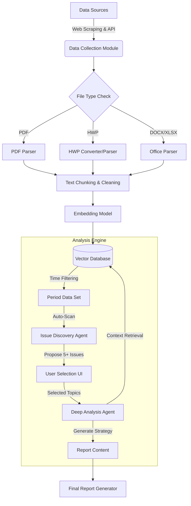
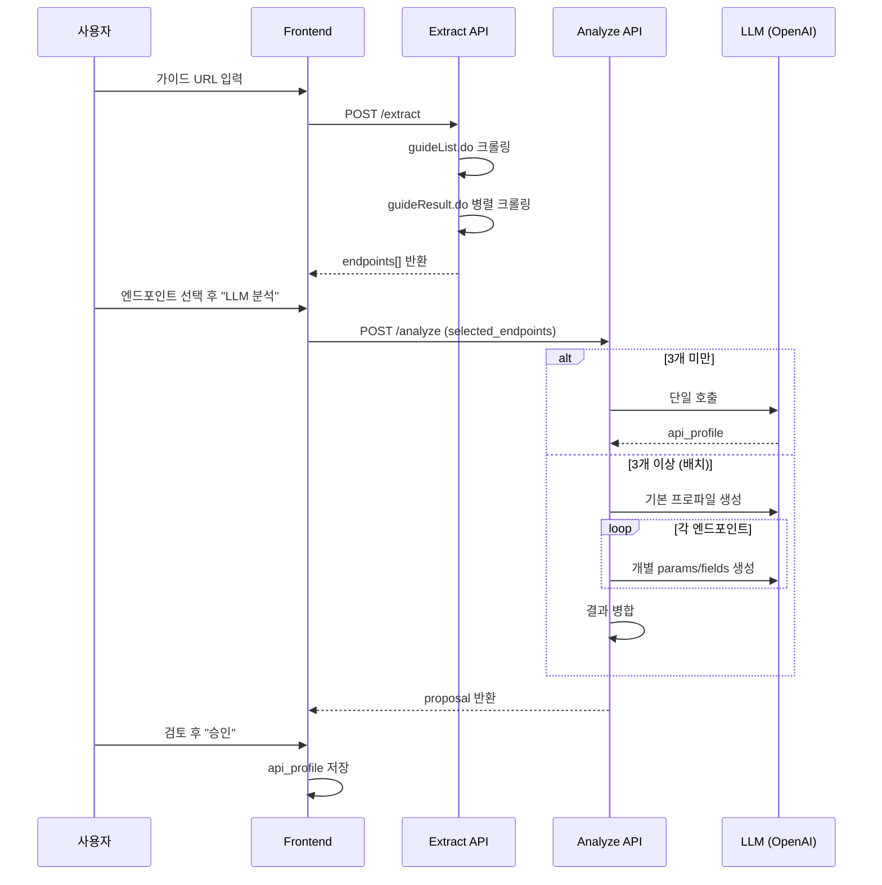
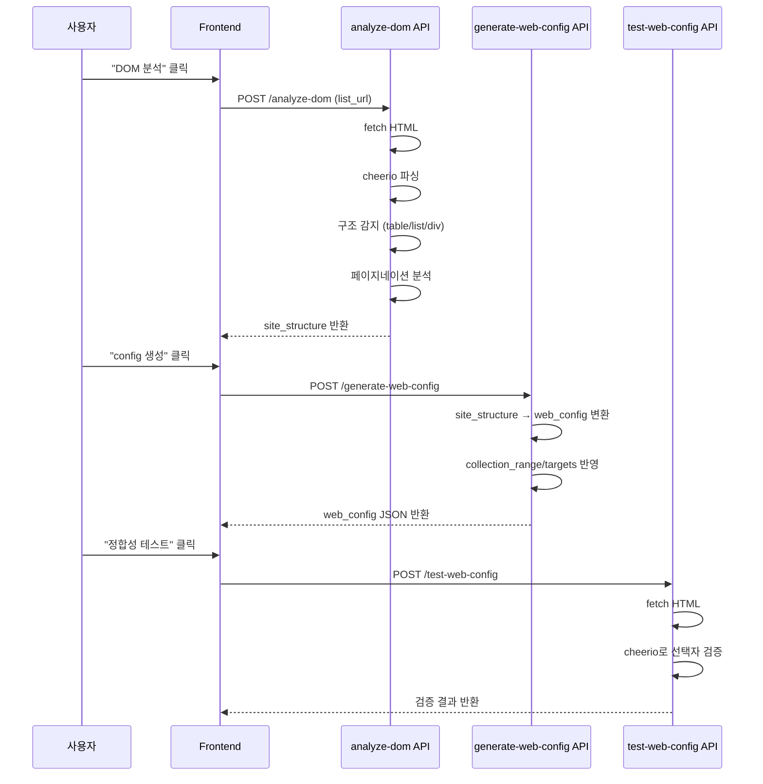
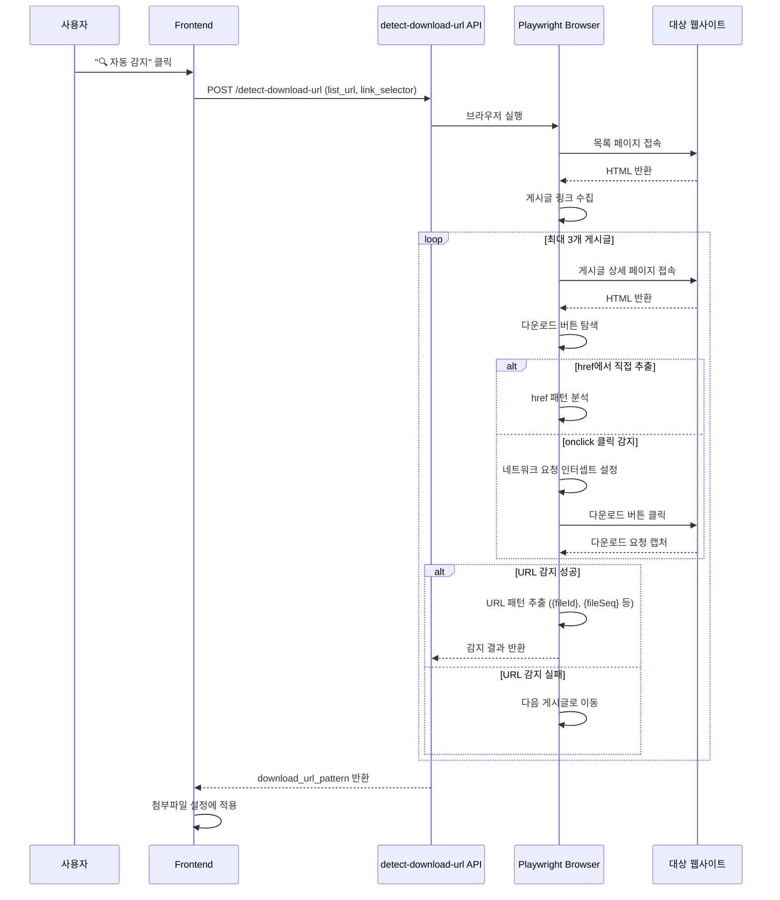
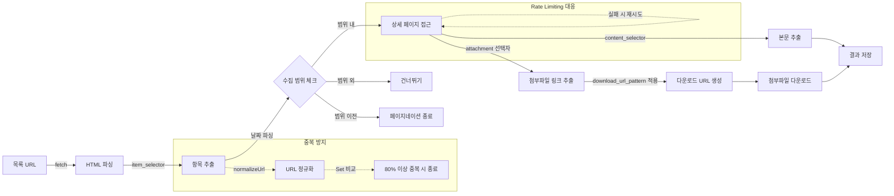

# [Project] EcoMonitor AI: 환경정책·법령 모니터링 및 보고서 자동화 플랫폼

## 1. 개요 (Overview)

본 프로젝트는 환경부, 산업통상자원부, 국가법령정보센터 등 다양한 소스에서 환경 관련 최신 규제 및 동향 데이터를 **자동으로 수집(Scraping)**하고, 이를 **벡터화(Vectorization)**하여 데이터베이스에 저장한 뒤, **RAG(검색 증강 생성) 기술**을 활용하여 고객 맞춤형 대응 전략이 포함된 **보고서 초안을 생성**하는 플랫폼을 구축하는 것을 목표로 한다.

### 1.1 핵심 목표

1. **데이터 수집 자동화**: 주요 정부 기관 및 협회 웹사이트, 법령 API를 통한 실시간 정보 수집.
2. **다양한 포맷 처리**: PDF, HWP, Word, Excel 등 비정형 데이터의 텍스트 추출 및 정제.
3. **능동적 이슈 발굴**: 특정 기간(분기/월간) 데이터를 자동 분석하여 중요 이슈를 선제적으로 제안.
4. **보고서 생성**: 분석된 내용을 바탕으로 전문적인 모니터링 보고서 초안 자동 생성.

---

## 2. 시스템 아키텍처 (System Architecture)



---

## 3. 구성 요소별 상세 구현 전략

### 3.1. 웹 스크래퍼 (Web Scraper Module)

정기적으로 타겟 웹사이트를 순회하며 최신 게시물과 첨부파일을 수집한다.

#### **A. 기술 스택**

- **Framework**: Python `Scrapy` (대규모 크롤링) 또는 `Playwright` (동적 페이지 처리)
- **Scheduling**: `APScheduler` 또는 `Celery` (일/주 단위 주기적 실행)

#### **B. 에러 대응 및 자동 복구 (Self-Healing)**

- **에러 로그/수정 모드**: 사이트 개편 등으로 스크래핑 실패 시 에러 로그를 분석한다.
- **LLM 기반 재구성**: '설정 재구성' 버튼 클릭 시, 변경된 사이트의 HTML 구조를 LLM에게 전달하여 새로운 CSS Selector/XPath를 추출하고 스크래핑 설정을 자동으로 업데이트한다.

#### **C. 주요 정보원 및 파싱 전략**

| 대상 기관            | URL (예시)                          | 데이터 유형                     | 파싱 및 수집 전략                                                                                                                                          |
| :------------------- | :---------------------------------- | :------------------------------ | :--------------------------------------------------------------------------------------------------------------------------------------------------------- |
| **환경부**           | me.go.kr (알림/홍보 > 뉴스·공지)    | 보도자료, 제·개정 고시(HWP/PDF) | - `Playwright`로 JS 렌더링 후 게시판 목록 순회.<br>- 게시물 ID 기반 중복 체크.<br>- 첨부파일 다운로드 링크 추출 및 저장.                                   |
| **산업통상자원부**   | motie.go.kr (뉴스/공지)             | 정책 브리핑, 입법예고           | - 환경부와 유사. 검색 필터에 '환경', '에너지' 키워드 적용.<br>- 게시판 Pagination 처리 로직 구현.                                                          |
| **국가법령정보센터** | law.go.kr (Open API)                | 법령, 행정규칙, 자치법규        | - **API 이용**: 공공데이터포털 API Key 발급.<br>- `requests` 라이브러리로 XML/JSON 데이터 수신.<br>- 최근 개정된 법령(환경 관련) 리스트 호출 후 본문 파싱. |
| **유관 협회**        | 대한전기협회, 한국전력기술인협회 등 | 기술 동향, 세미나 자료          | - 로그인 세션이 필요한 경우 `Session` 관리 구현.<br>- HTML 구조 변경에 대비해 CSS Selector를 설정 파일로 분리.                                             |

#### **C. 구현 포인트**

- **중복 방지**: 수집된 URL 또는 게시물 고유 ID(PK)를 DB(SQLite/PostgreSQL)에 저장하여 이미 수집된 건은 Skip.
- **메타데이터 확보**: 게시물 작성일(Date)은 기간별 분석의 핵심 키이므로 반드시 정확하게 파싱하여 저장.

#### **D. 설정 모델(운영 관점) - Collection Mode 중심**

운영/설정 UI 관점에서 대상 기관(Organization)의 `collection_mode`를 기준으로 보드(Board) 설정 템플릿을 분기한다.

- **`web_scraping`**: HTML 기반 목록/상세 파싱 + 첨부 다운로드 중심
- **`api_only`**: 엔드포인트/인증/파라미터/응답 매핑 + 증분 동기화 중심
- **`hybrid`**: (현재 목표) **API 목록 + 스크래핑 상세/첨부** 혼합 파이프라인

> 상세 스펙 및 UI 마법사 설계는 `ScrapingFuncSetting.md`의 "Board 재정의(개정안)" 및 "보드 편집 마법사" 항목을 기준으로 한다.

#### **E. API 초기 세팅(기관 레벨) - 전제 조건**

`api_only`/`hybrid` 기관은 보드별 API 설정 전에 **기관 레벨 `api_profile`**(인증/기본 파라미터/엔드포인트/응답 매핑)을 먼저 정의한다.  
특히 민감정보(API Key 등)는 설정 파일에 저장하지 않고 **환경변수/Secret Manager로 분리**하는 것을 원칙으로 한다.

> 상세 스키마/와이어프레임/시크릿 분리 규칙은 `ScrapingFuncSetting.md`의 "API Profile(기관 레벨)" 항목을 따른다.

---

### 3.2. 데이터 전처리 및 텍스트 추출 (Preprocessing & Extraction)

수집된 파일(Binary)을 LLM이 이해할 수 있는 텍스트(String)로 변환한다.

#### **A. 업로드 및 파싱 관리 (Upload & Parsing Management)**

- **스케줄 기반 저장**: 수집된 문서는 웹 스크래핑 스케줄명(예: '2026년 1분기')에 해당하는 폴더에 자동 분류되어 저장된다.
- **파싱 현황 시각화**: 태그 목록에서 스케줄을 선택하면, 해당 스케줄의 '스크래핑 진행률'과 '파싱 완료율'을 도넛 차트 형태로 대시보드에 표시한다.
- **텍스트 추출 결과 지표**:
  - 파일 전체 및 형식별(PDF, HWP 등) 추출 성공률/실패율 표시
  - 파싱 작업 수행 일시 및 총 소요 시간
  - 추출된 텍스트 데이터의 총 규모(Token/MB)

#### **B. 파일 포맷별 추출 전략**

1.  **PDF (`.pdf`)**

    - **Tool**: `PyMuPDF (fitz)` 또는 `pdfplumber`
    - **구현**: 텍스트 레이어가 살아있는 PDF는 직접 추출. 스캔본(이미지)인 경우 `OCR (Tesseract)` 또는 `Azure Document Intelligence` 연동 고려.
    - **전처리**: 머리글/바닥글 제거, 페이지 번호 제거.

2.  **아래아한글 (`.hwp`, `.hwpx`) - _Critical_**

    - **Tool**: `libhwp` (Python wrapper) 또는 `hwp5-parser`, 혹은 텍스트 변환기(`hwp5txt`) 서브프로세스 호출.
    - **구현**: HWP 파일 구조(OLE)를 분해하여 `BodyText` 섹션 내의 문자열만 추출. 표 안의 텍스트 순서가 섞이지 않도록 구조적 파싱 필요.

3.  **MS Office (`.docx`, `.xlsx`)**

    - **Word**: `python-docx` 라이브러리 사용. 문단(Paragraph) 단위로 텍스트 추출.
    - **Excel**: `pandas` 또는 `openpyxl`. 시트별로 데이터를 읽어 DataFrame -> String(Markdown Table) 형식으로 변환.

4.  **HTML 본문**
    - `BeautifulSoup4`를 사용하여 불필요한 태그(Script, Style, Nav) 제거 후 본문 텍스트(`get_text`)만 추출.

---

### 3.3. 벡터화 및 저장 (Vectorization & Storage)

추출된 텍스트를 의미론적 검색이 가능하도록 임베딩한다.

#### **A. 텍스트 청킹 (Chunking)**

- **전략**: 의미 단위 유지를 위해 `RecursiveCharacterTextSplitter` (LangChain) 사용.
- **설정**: Chunk Size 약 500~1000 tokens, Overlap 100~200 tokens.

#### **B. 임베딩 모델 (Embedding Model)**

- **모델**: 한국어 처리에 강한 모델 선택.
  - _Option 1 (API)_: OpenAI `text-embedding-3-small` / `large`.
  - _Option 2 (Local)_: HuggingFace `jhgan/ko-sroberta-multitask` 또는 `BAAI/bge-m3`.

#### **C. 벡터 데이터베이스 (Vector DB)**

- **Tool**: `ChromaDB` (로컬) 또는 `Pinecone` (클라우드).
- **필수 메타데이터**:
  - `published_date`: YYYY-MM-DD (기간 필터링용)
  - `source`: 출처 기관명
  - `doc_type`: 법령 / 고시 / 보도자료 / 기술문서

---

### 3.4. RAG 모델 및 분석 엔진 (RAG & Analysis Engine)

단순 검색을 넘어, 특정 기간의 데이터를 **자동 분석(Auto-Scan)**하고 이슈를 선별하는 지능형 엔진을 구현한다.

#### **A. Phase 1: 기간 기반 데이터 필터링 (Time-based Filtering)**

- **입력**: 분석 대상 기간 (예: 2024-01-01 ~ 2024-03-31)
- **동작**: Vector DB의 메타데이터(`published_date`)를 기준으로 해당 기간의 청크(Chunk)들을 1차 필터링하여 후보군(Document Set)을 생성한다.

#### **B. Phase 2: 자동 이슈 발굴 에이전트 (Issue Discovery Agent)**

사용자 질문 없이도 필터링된 데이터 셋을 전수 조사(또는 클러스터링)하여 주요 키워드와 이벤트를 추출한다.

- **Clustering**: 대량의 텍스트 청크를 유사 주제끼리 군집화(K-Means 등)하여 주요 토픽 그룹을 형성.
- **Summarization LLM**: 각 클러스터(토픽 그룹)별로 대표 요약문을 생성하고, 이를 '이슈 후보'로 정의.
- **Scoring**: 다음 기준에 따라 이슈의 중요도를 평가하여 상위 N개를 선정.
  1.  **법적 강제성**: 법령 제/개정 여부 (가중치 높음)
  2.  **신규성**: 기존에 없던 새로운 규제나 정책인지 여부
  3.  **파급력**: 업계 전반 혹은 특정 설비에 미치는 영향도
  4.  **국제 동향**: 해외 규제(EU CBAM 등)와의 연관성
- **Output**: **최소 5개 이상의 추천 이슈 리스트** 생성 (제목, 한 줄 요약, 관련 법령명 포함).

#### **C. Phase 3: 사용자 인터랙션 및 선정 (Interactive Selection)**

- **UI**: 발굴된 이슈 리스트를 카드 형태로 사용자에게 제시.
- **Action**: 사용자가 보고서에 수록하고 싶은 이슈들을 체크박스로 선택 (다중 선택 가능).

#### **D. Phase 4: 심층 분석 에이전트 (Deep Analysis Agent)**

사용자가 선택한 각 이슈에 대해 개별적인 심층 분석 RAG를 수행한다.

- **Process**:
  1.  **Retrieval**: 선택된 이슈 키워드로 Vector DB 재검색 (기간 내 데이터 + 필요시 기간 외 과거 이력 데이터 포함).
  2.  **Chain-of-Thought Prompting**: 다음 구조로 LLM이 단계적으로 사고하도록 유도.
      - **Step 1 (Fact Check)**: 정확한 법령명, 시행일, 변경 전/후 비교표 생성.
      - **Step 2 (Trend Analysis)**: 해당 이슈가 발생하게 된 배경(국제 동향, 정부 정책 기조) 분석.
      - **Step 3 (Impact)**: 발전소 및 관련 업종에 미치는 구체적 영향 (설비 투자 필요성, 운영 비용 등).
      - **Step 4 (Response)**: 가이드라인 기반 대응 전략 수립 (인허가 갱신, 설비 개선, 모니터링 강화 등).

---

### 3.5. 보고서 생성 (Report Generation)

심층 분석 결과를 통합하여 최종 보고서 포맷으로 변환한다.

#### **A. 보고서 구조화**

- **Section 1: Executive Summary** (전체 이슈 요약)
- **Section 2: 이슈별 상세 분석** (사용자가 선택한 이슈 개수만큼 반복)
  - 2.1. 이슈 개요 및 배경
  - 2.2. 주요 변경 사항 (법령/규제)
  - 2.3. 산업계 영향 분석
  - 2.4. 대응 전략 및 제언
- **Section 3: 참고 자료** (관련 고시 원문 링크, 출처)

#### **B. 파일 변환**

- `python-docx`를 사용하여 Word 문서 생성.
- 표(Table), 강조 구문(Bold), 글머리 기호 등을 적용하여 가독성 확보.

---

## 4. 개발 로드맵 (Development Roadmap)

### **Step 1: 데이터 파이프라인 구축 (기초)**

- [ ] Python 프로젝트 환경 설정
- [ ] 환경부/산업부/법제처 API 스크래퍼 개발 (날짜 메타데이터 파싱 필수)
- [ ] HWP/PDF 텍스트 추출기 및 전처리 모듈 구현
- [ ] Vector DB 스키마 설계 (날짜 필드 인덱싱) 및 적재

### **Step 2: 이슈 발굴 엔진 구현 (코어)**

- [ ] 기간별 데이터 필터링 쿼리 구현
- [ ] 텍스트 클러스터링 및 토픽 모델링(BERTopic 등) 테스트
- [ ] 이슈 중요도 평가 프롬프트 엔지니어링 (LLM)
- [ ] 자동 이슈 추천(Top 5+) 기능 구현

### **Step 3: 심층 분석 및 리포팅**

- [ ] 선택된 이슈에 대한 심층 분석 프롬프트 개발 (CoT 적용)
- [ ] 보고서 템플릿 디자인 및 `python-docx` 연동
- [ ] 전체 파이프라인 통합 테스트 (수집 -> 발굴 -> 선택 -> 분석 -> 생성)

### **Step 4: UI/UX 및 배포**

- [x] **Next.js + Tailwind CSS 기반 프론트엔드 구축**
  - [x] 메인 레이아웃 (Sidebar + TopBar + GNB)
  - [x] Glassmorphism "Warm Glass" 테마 적용
  - [x] 대상 기관 관리 UI (기관/보드 CRUD)
  - [x] API 초기 세팅 모달 (LLM 분석 + 승인 프로세스)
  - [x] 보드 설정 마법사 (3단계)
    - [x] Step 1: 수집 범위/대상 설정 UI
    - [x] Step 2: DOM 분석 + web_config 자동 생성
    - [x] Step 3: 스크래핑 테스트 + 로그 표시
  - [x] 스케줄 설정 모달 (캘린더 UI + 주기 설정)
  - [x] **DOM 분석 기능** (cheerio 기반, LLM 대체)
  - [x] **web_config 자동 생성/정합성 테스트**
  - [x] **스크래핑 테스트 기능** (목록/본문/첨부파일)
  - [x] **설정/에러 수정 UI** (다운로드 관리 옵션)
  - [x] **다운로드 URL 자동 감지** (Playwright 기반)
  - [x] **페이지네이션 분석 강화** (다양한 유형 자동 감지)
  - [x] **날짜 파싱 개선** (기간 형식, 다국어 지원)
  - [ ] 수집 현황 대시보드

---

## 5. 프론트엔드 구현 현황 (Frontend Implementation Status)

> **최종 업데이트**: 2026-01-15 (다운로드 URL 자동 감지, 날짜 파싱 개선, 페이지네이션 분석 강화)

### 5.1 기술 스택

| 구분 | 도구 | 버전 | 비고 |
|:---|:---|:---:|:---|
| **Framework** | Next.js (App Router) | 15.x | React Server Components |
| **Styling** | Tailwind CSS | 3.4.x | Glassmorphism 테마 |
| **Component** | shadcn/ui | - | 접근성 우수 |
| **Icons** | Lucide React | - | 라인 아이콘 |
| **Font** | Pretendard | - | 한/영 가독성 |
| **LLM** | OpenAI/Gemini/Anthropic | - | API 프로파일 자동 생성 |
| **Browser Automation** | Playwright | - | 다운로드 URL 자동 감지, 동적 페이지 렌더링 |
| **HTML Parser** | cheerio | 1.0.0-rc.12 | DOM 분석, 스크래핑 |

### 5.2 주요 화면별 구현 상태

| 화면 | 경로 | 상태 | 주요 기능 |
|:---|:---|:---:|:---|
| **대시보드** | `/` | 🔄 70% | 개요 카드, 통계 위젯 |
| **대상 기관 관리** | `/scraper/targets` | ✅ 100% | 기관/보드 CRUD, API 세팅, 마법사, DOM 분석, 스크래핑 테스트, 다운로드 URL 자동 감지 |
| **스케줄링 설정** | `/scraper/schedule` | ✅ 90% | 스케줄 목록, CRUD, 즉시 실행 |
| **수집 현황** | `/scraper/status` | 📋 10% | 페이지 스캐폴딩 |
| **설정/에러 수정** | `/scraper/logs` | ✅ 80% | 다운로드 관리(완료), 로그 분석(준비중), 변경 감지(준비중) |
| **텍스트 추출** | `/data/documents` | 📋 10% | 페이지 스캐폴딩 |
| **벡터화** | `/data/vector-db` | 📋 10% | 페이지 스캐폴딩 |
| **이슈 발굴** | `/rag/discovery` | 📋 10% | 페이지 스캐폴딩 |
| **보고서 생성** | `/rag/report` | 📋 10% | 페이지 스캐폴딩 |
| **로그인** | `/login` | ✅ 100% | JWT 인증 |
| **설정** | `/settings/*` | 🔄 50% | 시스템/사용자 설정 |

### 5.3 핵심 기능 상세

#### A) 대상 기관 관리 (`/scraper/targets`)

**구현 완료 기능**:
- 기관 목록: 태그 기반 UI, 필터링, 검색
- 기관 상세: 이름, URL, 수집 모드, 상태, 메모 편집
- API 초기 세팅:
  - 가이드 URL/파일 업로드
  - API 정보 자동 추출 (open.law.go.kr 지원)
  - LLM 기반 API 프로파일 생성 (배치 처리)
  - 테스트 호출 및 승인 프로세스
- 보드 설정 마법사:
  - Step 1: 기본 정보 (이름, 문서 유형, 분야 태그)
    - **수집 범위 설정**: 기간/상대 일수/연도 선택 (상호 배타적)
    - **수집 대상 설정**: 제목/본문, 첨부파일(전체/형식별)
  - Step 2: 수집 설정 (Web Scraping / API / Hybrid 분기)
    - **게시일 규칙**: DOM 분석 → LLM 분석 → 테스트 → 수정 요청
    - **web_config**: DOM 분석 기반 자동 생성 → 정합성 테스트
    - **첨부파일 다운로드 URL 자동 감지** (Playwright 기반)
  - Step 3: 검증 (설정 요약, **스크래핑 테스트**, 저장)
- 검색 필터: 필드별 키워드, OR/AND 조건
- 날짜 필터: 범위/상대 일수 설정
- 스케줄 설정: 기간/주기 + 캘린더 UI

#### A-1) DOM 분석 기능 (✅ 강화 완료)

> **배경**: LLM 기반 HTML 분석의 정확도 한계 극복

- **cheerio 기반 직접 DOM 분석**: 실제 HTML을 파싱하여 게시판 구조 자동 감지
- **지원 구조**: 테이블(`table > tbody > tr`), 리스트(`ul > li`), 반복 div 패턴
- **페이지네이션 자동 감지** (2026-01-15 강화):
  - `page_param`: URL 쿼리 파라미터 기반 (예: `?page=2`)
  - `next_button`: "다음" 버튼 클릭 기반
  - `load_more`: "더보기" 버튼 기반
  - `javascript`: JavaScript 함수 호출 기반 (예: `fnPage(2)`)
  - `infinite_scroll`: 무한 스크롤 기반
- **출력**: `site_structure` (container, item, parse_rules, pagination, sample_data)
- **API**: `POST /api/scraper/targets/boards/analyze-dom`

#### A-2) web_config 자동 생성 (✅ 신규 구현)

- **DOM 분석 결과 기반**: `site_structure`를 `web_config` JSON으로 변환
- **Step 1 설정 반영**: `collection_range`, `collection_targets` 자동 포함
- **정합성 테스트**: cheerio로 선택자 유효성 검증 (최소 3개 항목 필수)
- **LLM 수정 요청**: 테스트 실패 시 오류 로그를 LLM에 전달하여 재분석

#### A-3) 스크래핑 테스트 (✅ 신규 구현)

- **기능**: 생성된 config로 실제 스크래핑 시뮬레이션
- **테스트 범위**: 목록 10개 → 상세 페이지 → 본문 + 첨부파일
- **Rate Limiting 대응**: 500ms 딜레이, 재시도 로직 (최대 2회)
- **로그 출력**: 항목명, 본문 요약(30자), 첨부파일 링크
- **API**: `POST /api/scraper/targets/boards/test-scraping`

#### A-4) 다운로드 URL 자동 감지 (✅ 2026-01-15 신규 구현)

> **배경**: 사이트별로 첨부파일 다운로드 URL 패턴이 다르며, 수동 분석에 시간 소요

- **Playwright 기반 헤드리스 브라우저**: 실제 다운로드 버튼 클릭 시 발생하는 네트워크 요청 캡처
- **다중 게시글 시도**: 첫 번째 게시글에서 감지 실패 시 최대 3개 게시글까지 순차 시도
- **지원 패턴**:
  - 직접 `href` 링크 (예: `/file/download/{fileId}`)
  - `onclick` 함수 파라미터 추출 (예: `fnDownload('fileId', 'fileKey')`)
  - 네트워크 요청 인터셉트 (다운로드 이벤트 캡처)
- **URL 패턴 자동 생성**: 감지된 URL에서 ID 부분을 `{placeholder}`로 치환
  - 예: `/file/download/10568532/VULPRZ16RYSO7IWUPRK2` → `/file/download/{fileId}/{fileKey}`
  - 예: `/home/file/readDownloadFile.do?fileId=313774&fileSeq=1` → `/home/file/readDownloadFile.do?fileId={fileId}&fileSeq={fileSeq}`
- **API**: `POST /api/scraper/targets/boards/detect-download-url`

#### A-5) 날짜 파싱 개선 (✅ 2026-01-15 강화)

> **배경**: 다양한 사이트의 날짜 형식 지원 필요 (특히 국민참여입법센터의 기간 형식)

**지원 날짜 형식**:

| 형식 유형 | 예시 | 설명 |
|:---|:---|:---|
| 기간 (시작일 추출) | `2026. 1. 12.~2026. 2. 23.` | 국민참여입법센터 예고기간 |
| 점+공백 | `2026. 1. 12.` | 한국 정부 사이트 일반 형식 |
| ISO 형식 | `2026-01-12` | 표준 형식 |
| 슬래시 형식 | `2026/01/12` | 일부 사이트 형식 |
| 2자리 연도 | `26-01-12` | 축약 연도 |
| 한글 형식 | `2026년 1월 12일` | 한국어 표기 |

#### B) 설정/에러 수정 (`/scraper/logs`) — ✅ 신규 구현

> **배경**: 다운로드 관리, 에러 로그 분석, 사이트 구조 변경 감지 기능 통합

##### B-1) 다운로드 관리 옵션 (✅ UI 완료)

6:4 비율 레이아웃 (왼쪽: 다운로드 관리 / 오른쪽: 로그 분석 + 변경 감지)

**5개 카테고리 통합 카드 (2열 배치)**:

1. **저장 경로 관리** (필수)
   - 기본 저장 경로 + 폴더 선택 버튼 (File System Access API)
   - 폴더 구조 규칙 (flat, by_org, by_org_board, by_org_board_date, by_date_org_board)
   - 파일명 규칙 (original, date_prefix, docid_prefix, datetime_prefix)

2. **다운로드 실패 대처** (권장)
   - 재시도 횟수, 재시도 간격
   - Exponential Backoff (도움말 툴팁 제공)
   - 타임아웃, 실패 시 동작 (skip, log_only, stop)

3. **파일 관리** (권장)
   - 최대 파일 크기, 동시 다운로드 수
   - 중복 파일 처리 (skip, overwrite, version)
   - 허용 확장자

4. **네트워크/보안** (선택)
   - SSL 검증 우회, Referer 헤더 자동 설정
   - User-Agent, 프록시 URL

5. **저장 공간 관리** (선택)
   - 경고 임계값, 용량 제한
   - 자동 정리 활성화/기준 일수

##### B-2) 로그 분석 및 에러 관리 (🔄 준비 중)

- 에러 통계 (최근 24시간/7일, 해결 대기 중)
- 에러 유형별 분석 (타임아웃, HTTP 오류, 파싱 실패, 네트워크 오류)
- 빠른 작업 (실패 항목 재시도, 로그 내보내기, 에러 초기화)

##### B-3) 변경 감지 / Config 수정 (🔄 준비 중)

- 사이트 구조 변경 자동 감지 설정 (주기, 알림 방식)
- 감지된 구조 변경사항 목록
- "보드 설정 마법사" 바로가기, "API 설정 수정" 버튼

#### C) API 프로파일 자동 생성 프로세스



### 5.4 파일 경로 매핑

| 기능 | 프론트엔드 | API Route | 데이터 |
|:---|:---|:---|:---|
| 기관 관리 | `app/(app)/scraper/targets/page.tsx` | `api/scraper/targets/orgs/` | `data/scraper-targets.json` |
| 보드 관리 | (위와 동일) | `api/scraper/targets/boards/` | `data/scraper-targets.json` |
| **DOM 분석** | (위와 동일) | `api/scraper/targets/boards/analyze-dom/route.ts` | - |
| **게시일 규칙** | (위와 동일) | `api/scraper/targets/boards/analyze-date-rule/route.ts` | - |
| **규칙 테스트** | (위와 동일) | `api/scraper/targets/boards/test-date-rule/route.ts` | - |
| **Config 생성** | (위와 동일) | `api/scraper/targets/boards/generate-web-config/route.ts` | - |
| **정합성 테스트** | (위와 동일) | `api/scraper/targets/boards/test-web-config/route.ts` | - |
| **스크래핑 테스트** | (위와 동일) | `api/scraper/targets/boards/test-scraping/route.ts` | - |
| **다운로드 URL 감지** | (위와 동일) | `api/scraper/targets/boards/detect-download-url/route.ts` | - |
| API 추출 | (위와 동일) | `api/.../api-profile/extract/route.ts` | `data/APISet/{org}.json` |
| LLM 분석 | (위와 동일) | `api/.../api-profile/analyze/route.ts` | - |
| 테스트 호출 | (위와 동일) | `api/.../api-profile/test/route.ts` | - |
| 스케줄 | `app/(app)/scraper/schedule/page.tsx` | `api/scraper/schedule/` | `data/scraper-schedules.json` |
| **즉시 실행** | (위와 동일) | `api/scraper/execute/instant/stream/route.ts` | - |
| **다운로드 설정** | `app/(app)/scraper/logs/page.tsx` | `api/scraper/settings/download/route.ts` | `data/download-settings.json` |
| 레이아웃 | `components/layout/Sidebar.tsx` | - | `config/menu.ts` |
| 스타일 | `app/globals.css` | - | - |
| **타입 정의** | `lib/scraper/targets-store.ts` | - | - |

### 5.5 LLM 통합

#### 지원 모델

| Provider | Model | max_tokens | 용도 |
|:---|:---|:---:|:---|
| OpenAI | gpt-4o-mini | 16,384 | API 프로파일 생성 (기본) |
| Google | gemini-1.5-flash | 8,192 | 대안 |
| Anthropic | claude-3-haiku | 8,192 | 대안 |

#### 환경변수 설정

```bash
# frontend/.env.local
OPENAI_API_KEY=sk-...
GEMINI_API_KEY=...
ANTHROPIC_API_KEY=...
```

#### 프롬프트 구조

```
[System] You extract API specs and return JSON only.
[User]
- 분석 규칙 (인증, 파라미터, 응답 필드 추출)
- 출력 스키마 (api_profile JSON 구조)
- 입력 데이터 (가이드 URL 텍스트 + 선택된 엔드포인트)
- 검증 체크리스트 (필수 포함 개수)
```

### 5.6 핵심 구현 상세 (2026-01-15 업데이트)

#### A) DOM 분석 아키텍처



#### B) 다운로드 URL 자동 감지 아키텍처 (신규)



#### C) 스크래핑 실행 파이프라인 (개선)



#### D) 의존성 패키지

| 패키지 | 버전 | 용도 |
|:---|:---:|:---|
| `cheerio` | 1.0.0-rc.12 | 서버사이드 DOM 파싱 |
| `playwright` | - | 헤드리스 브라우저, 다운로드 URL 감지 |
| `node-fetch` | 내장 (Node 18+) | HTTP 요청 |
| `openai` | - | LLM API 호출 |
| `xlsx` | - | Excel 파일 생성 |

#### E) 주요 타입 정의 (`lib/scraper/targets-store.ts`)

```typescript
// 수집 범위
export type CollectionRange = {
  type: "period" | "relative" | "yearly" | "";
  period_start?: string;
  period_end?: string;
  relative_days?: number;
  years?: number[];
};

// 수집 대상
export type CollectionTargets = {
  title_body: boolean;
  attachments: {
    enabled: boolean;
    all: boolean;
    hwpx: boolean;
    docx: boolean;
    xlsx: boolean;
    pdf: boolean;
  };
};

// 첨부파일 설정 (신규 필드 추가)
export type AttachmentConfig = {
  enabled?: boolean;
  selector?: string;
  button_selector?: string;
  download_url_pattern?: string;  // 다운로드 URL 패턴 (예: /file/download/{fileId}/{fileKey})
};

// 페이지네이션 설정 (강화)
export type PaginationConfig = {
  type: "page_param" | "next_button" | "load_more" | "javascript" | "infinite_scroll" | "none";
  selector?: string;
  param_name?: string;
  js_function?: string;
  max_pages?: number;
};

// Board 타입에 추가된 필드
export type Board = {
  // ... 기존 필드 ...
  collection_range?: CollectionRange;
  collection_targets?: CollectionTargets;
  web_config?: WebConfig;
  attachment_config?: AttachmentConfig;  // 첨부파일 설정
};
```

#### F) 다운로드 설정 스키마

```typescript
// 다운로드 설정 타입
export type DownloadSettings = {
  path: {
    basePath: string;                      // 기본 저장 경로
    folderStructure: FolderStructure;      // 폴더 구조 규칙
    fileNameRule: FileNameRule;            // 파일명 규칙
  };
  retry: {
    maxRetries: number;                    // 재시도 횟수
    retryIntervalSec: number;              // 재시도 간격 (초)
    useExponentialBackoff: boolean;        // Exponential Backoff 사용
    timeoutSec: number;                    // 타임아웃 (초)
    failureAction: FailureAction;          // 실패 시 동작
  };
  fileManagement: {
    maxFileSizeMb: number;                 // 최대 파일 크기 (MB)
    duplicateHandling: DuplicateHandling;  // 중복 파일 처리
    allowedExtensions: string[];           // 허용 확장자
    concurrentDownloads: number;           // 동시 다운로드 수
  };
  network: {
    skipSslVerification: boolean;          // SSL 검증 우회
    customUserAgent: string;               // User-Agent
    proxyUrl: string;                      // 프록시 URL
    autoReferer: boolean;                  // Referer 헤더 자동 설정
  };
  storage: {
    warningThresholdGb: number;            // 경고 임계값 (GB)
    autoCleanupEnabled: boolean;           // 자동 정리 활성화
    autoCleanupDays: number;               // 자동 정리 기준 일수
    maxStorageGb: number;                  // 용량 제한 (GB)
  };
  updatedAt: string;                       // 마지막 업데이트 시각
};

// Enum Types
type FolderStructure = "flat" | "by_org" | "by_org_board" | "by_org_board_date" | "by_date_org_board";
type FileNameRule = "original" | "date_prefix" | "docid_prefix" | "datetime_prefix";
type DuplicateHandling = "skip" | "overwrite" | "version";
type FailureAction = "skip" | "log_only" | "stop";
```

---

## 6. 스크래핑 로직 개선 이력 (2026-01-15)

### 6.1 중복 페이지 감지 개선

**문제**: 페이지네이션 시 동일 게시글이 반복 수집되는 현상 (예: 13개 게시글이 130개로 수집)

**해결**:
- `normalizeUrl` 함수 도입: URL 쿼리 파라미터 중 ID 관련 파라미터만 추출하여 비교
  - 포함 파라미터: `boardId`, `seq`, `idx`, `no`
- 페이지 간 링크 Set 비교: 현재 페이지의 80% 이상 링크가 이전 페이지와 중복 시 페이지네이션 종료

### 6.2 첨부파일 다운로드 URL 패턴 지원

**문제**: 사이트별로 다운로드 URL 구조가 상이하여 하드코딩 필요

**해결**:
- `download_url_pattern` 필드 도입: `{fileId}`, `{fileKey}`, `{fileSeq}` 등 플레이스홀더 지원
- 자동 감지 API: Playwright로 실제 다운로드 요청을 캡처하여 패턴 추출
- `generate-web-config` API에서 감지된 패턴을 `web_config.attachments.download_url_pattern`에 자동 반영

### 6.3 날짜 파싱 강화

**문제**: 국민참여입법센터의 기간 형식 (`2026. 1. 12.~2026. 2. 23.`) 파싱 실패

**해결**:
- `parseDate` 함수 개선: 기간 형식에서 시작일 추출
- 지원 형식 확대: 점+공백, ISO, 슬래시, 한글 형식 등
